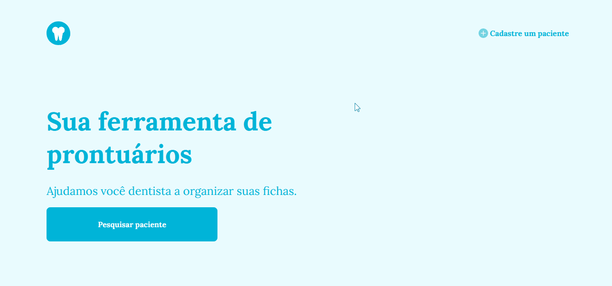

# 🦷 Prontuario 😁➕

# 🚧 Em construção 🚧

## 🎯 Objetivos:
- Exercitar meu conhecimento em Front-end;
- Divulgar meu nível como desenvolvedor;

 ---

## 📑 Descrição do projeto:
Criar uma aplicação web que dê praticidade, agilidade e segurança para quem trabalha com folhas de protuários em consultórios odontológicos, trocando a documentação física por uma digital, evitando perdas, ganhando espaço físico e colaboram com o meio ambiente.

 ---

 ## 🎥 Preview:

